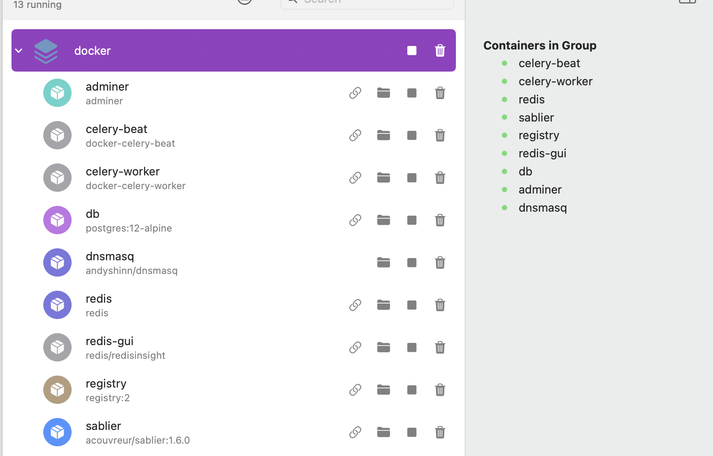

# Contributing to ZaneOps

Thank you for showing an interest in contributing to ZaneOps! All kinds of contributions are valuable to us. In this guide,
we will cover how you can quickly onboard and make your first contribution.

By participating in this project, you agree to abide by our [Code of Conduct](./CODE_OF_CONDUCT.md), and by opening a
pull request, to the [contribution license agreement](#submitting-a-pull-request) included in the pull request template.

## Testing the app

One of the best ways to contribute is by installing and using the application. You can even do so locally and report any bugs you encounter or suggest features you need. For instructions on how to install and set up ZaneOps, [see here](https://zaneops.dev/docs/get-started/).


## Submitting an issue

Before submitting a new issue, please search the [issues](https://github.com/zane-ops/zane-ops/issues) tab. Maybe an
issue or discussion already exists and might inform you of workarounds. Otherwise, you can give new information.

While we want to fix all the [issues](https://github.com/zane-ops/zane-ops/issues), before fixing a bug we need to be
able to reproduce and confirm it. Please provide us with a minimal reproduction scenario using a repository
or [Gist](https://gist.github.com/). Having a live, reproducible scenario gives us the information without asking
questions back & forth with additional questions like:

- 3rd-party libraries being used and their versions
- a use-case that fails

Without said minimal reproduction, we won't be able to investigate
all [issues](https://github.com/zane-ops/zane-ops/issues), and the issue might not be resolved.

You can open a new issue with this [issue form](https://github.com/zane-ops/zane-ops/issues/new).

## How to work on the project ?

### Prerequisites

| Tool                                          | Version | Notes                                                                 |
| --------------------------------------------- | ------- | --------------------------------------------------------------------- |
| [Docker](https://docs.docker.com/get-docker/) | latest  | With **swarm mode** available, `make setup` initializes it for you.   |
| [Node.js](https://nodejs.org/)                | 20      |                                                                       |
| [pnpm](https://pnpm.io/installation)          | 8.15.9  | The version is pinned via `packageManager` in `package.json`.         |
| Python                                        | 3.13+   | The exact version used is in `backend/.python-version`.               |
| [uv](https://docs.astral.sh/uv/)              | latest  | Installed by `make setup` if missing, manages the backend virtualenv. |

1. First you have to clone the repository

    ```shell
    git clone https://github.com/zane-ops/zane-ops.git
    ``` 

2. Then run the setup script :

   ```shell
   make setup
   ```

   If you receive this error message :

    ```
    Error response from daemon: This node is already part of a swarm. Use "docker swarm leave" to leave this swarm and join another one.
    ```
   You can safely ignore it, it means that you have already initialized docker swarm.

3. Setup the environment variables :

   There are **three** `.env.example` files to copy, one per part of the project :

   ```shell
   cp .env.example .env
   cp backend/.env.example backend/.env
   cp frontend/.env.example frontend/.env
   ```

   **`.env`** (root) — used by the helper scripts ran by `make dev` :

   | Variable   | Required | Description                                                                                                                                                     |
   | ---------- | -------- | --------------------------------------------------------------------------------------------------------------------------------------------------------------- |
   | `WH_TOKEN` | no       | Token used by `start-webhook-catcher.sh` to catch webhooks locally, go to https://webhook.site to get one. If unset, the webhook catcher is simply not started. |

   **`backend/.env`** — loaded by Django in development (`backend/backend/settings.py`) :

   | Variable                      | Required | Default                 | Description                                                                                                 |
   | ----------------------------- | -------- | ----------------------- | ----------------------------------------------------------------------------------------------------------- |
   | `BUILD`                       | no       | `oss`                   | Edition of the API : `oss` or `ee`. `ee` loads the commercial layer in `ee/` and enables licensed features. |
   | `OTEL_TRACES_ENABLED`         | no       | `false`                 | Enable OpenTelemetry tracing.                                                                               |
   | `OTEL_EXPORTER_OTLP_ENDPOINT` | no       | `http://127.0.0.1:4317` | OTLP collector endpoint, only used when tracing is enabled.                                                 |

   **`frontend/.env`** — read by Vite, only variables prefixed with `VITE_` are exposed to the app :

   | Variable                  | Required | Default | Description                                                                                                       |
   | ------------------------- | -------- | ------- | ----------------------------------------------------------------------------------------------------------------- |
   | `VITE_BUILD`              | no       | `oss`   | Edition of the frontend : `oss` or `ee`. It is **inlined at build time**, so the value must be set when building. |
   | `VITE_WEBHOOK_SITE_TOKEN` | no       | —       | Same webhook.site token as `WH_TOKEN`, used by the frontend for webhook examples.                                 |

> [!IMPORTANT]
> `BUILD` (backend) and `VITE_BUILD` (frontend) must **always match**, otherwise the UI will show/hide features
> that the API does not agree with. In CI, both are driven by the same `oss`/`ee` matrix.

4. Start the project :

   Start the DEV server :
    ```shell
    make dev
    # or
    pnpm run --recursive --parallel dev
    ```

   Wait until you see `Server launched at http://localhost:5173` in the terminal.
   
5. Run DB migrations :

    ```shell
    make migrate
    ```

6. Open the source code and start working :

   The app should be available at http://localhost:5173

### Useful commands

| Command                                   | Description                                                                     |
| ----------------------------------------- | ------------------------------------------------------------------------------- |
| `make dev`                                | Start everything (frontend, API, temporal workers and the docker dependencies). |
| `make dev-api`                            | Same, but without the frontend.                                                 |
| `make migrate`                            | Apply the database migrations.                                                  |
| `make reset-db`                           | ⚠️ Wipe the database and reset the app to its initial state.                     |
| `pnpm test`                               | Run all the tests (in practice, the backend test suite).                        |
| `pnpm --prefix backend run makemigration` | Create new Django migrations.                                                   |
| `pnpm --prefix backend run shell`         | Open a Django shell with IPython.                                               |
| `pnpm run gen:api`                        | Regenerate the OpenAPI schema **and** the frontend API client.                  |
| `pnpm run format`                         | Format the frontend & docker files with Biome.                                  |
| `pnpm --prefix frontend run typecheck`    | Typecheck the frontend.                                                         |

The tests need the docker dependencies (postgres, redis, loki, the proxy…) to be up, so keep `make dev` running in
another terminal while you run them.

To run only a subset of the backend tests :

```shell
cd backend && pnpm test -- <app_name> -k <pattern>
```

The Temporal UI is available at http://localhost:8082, it is the place to look at when a deployment is stuck.

## Debugging

You may end up having issues where the project is not working, the app is not reachable on the browser, or the API seems
to be down, this section is to help debugging this case, if the app is working fine on your end, you don't need to read
this section.

1. make sure you ran `make dev` and it didn't exit unexpectedly
2. make sure that all the containers are up, you can check it in your docker tool of choice, [orbstack](https://orbstack.dev/) or [docker desktop](https://www.docker.com/products/docker-desktop/)
   
3. make sure that the API is launched, and that no error is in thrown in the terminal where `make dev` is running
4. make sure to setup the project and install the packages with `make setup`
5. If the app is still unresponsive, run `make reset-db` However, it's crucial to note that this action will completely
   erase all data in the database and reset the project to its initial state.

## Project structure

A quick look at the top-level files and directories you will see in this project.

```
.
├── .github/
│   ├── pull_request_template.md
│   ├── ISSUE_TEMPLATE/
│   └── workflows/
│       ├── pytests.yaml
│       ├── check-format.yaml
│       ├── build-push-images-dev.yaml
│       ├── build-push-images-canary.yaml
│       └── build-push-images-tag.yaml
├── backend/
│   ├── zane_api/
│   ├── temporal/
│   ├── compose/
│   ├── git_connectors/
│   └── ee/
├── frontend/
│   └── app/
├── docker/
│   ├── app/
│   ├── proxy/
│   ├── docker-stack.yaml
│   └── docker-compose.yaml
├── deploy-scripts/
└── openapi/
    └── schema.yml
```


1. **`backend/`**: A standard Django app. The API source code is located in the `backend/zane_api/` folder, the Temporal workflows & activities in `backend/temporal/`, and the commercial (EE) layer in `backend/ee/`.

2. **`frontend/`**: Contains the frontend code built with Vite and React Router, the source files are in `frontend/app/`. `frontend/app/api/v1.ts` is **generated** from the OpenAPI schema, never edit it by hand.

3. **`.github/`**: Contains the GitHub Actions workflow configurations for Continuous Integration/Continuous Deployment (CI/CD).
    1. **`check-format.yaml`**: Checks that the frontend files are properly formatted using Biome.
    2. **`pytests.yaml`**: Runs tests for the project's API.
    3. **`build-push-images-dev.yaml`**: Builds the docker images of each component of zaneops for each Pull Request 
    4. **`build-push-images-canary.yaml`**:  Builds the docker images of each component of zaneops when PR are merged to `main`, each image will have the tag of `canary`
    5. **`build-push-images-tag.yaml`**: Builds the docker images when a `v*` tag is pushed, and creates a draft GitHub release.

    The three build workflows run a `oss`/`ee` matrix : the frontend is built once per edition with `VITE_BUILD=<edition>`,
    and the matching build artifact is passed to the app image built with `BUILD=<edition>`. The `ee` images are published
    with an `ee-` tag prefix (ex: `ghcr.io/zane-ops/app:ee-canary`).

4. **`docker/`**: Contains Docker-specific files for working with the project locally:
    1. **`docker-compose.yaml`**: Defines the Docker Compose configuration for services used in development, such as Redis, Postgres, and Temporal.
    2. **`docker-stack.yaml`**: Specifies services in development that need to work within Docker Swarm, notably Caddy (Zane Proxy), which exposes the deployed services to HTTP.

5. **`deploy-scripts/`**: Scripts used to install and upgrade ZaneOps on a server.

6. **`openapi/schema.yml`**: Contains the OpenAPI schema generated from the backend API, it is the source of truth for the frontend API client.


## Missing a Feature?

If a feature is missing, you can directly _request_ a new
one [here](https://github.com/zane-ops/zane-ops/issues/new?assignees=&labels=feature&template=feature_request.yml&title=%F0%9F%9A%80+Feature%3A+).
You also can do the same by choosing "🚀 Feature" when raising
a [New Issue](https://github.com/zane-ops/zane-ops/issues/new/choose) on our GitHub Repository.
If you would like to _implement_ it, an issue with your proposal must be submitted first, to be sure that we can use it.
Please consider the guidelines given below.

## Coding guidelines

To ensure consistency throughout the source code, please keep these rules in mind as you are working:

- All backend features or bug fixes must be tested by one or more specs (unit-tests or functionnal tests), tests live in
  `<app>/tests/` (ex: `backend/zane_api/tests/`).
- The backend dependencies are managed with [uv](https://docs.astral.sh/uv/), if you add a package, add it to
  `backend/pyproject.toml` and run `pnpm --prefix backend run lock` to update `uv.lock`.
- If you change the API (views, serializers, urls), regenerate the schema & the frontend client with `pnpm run gen:api`,
  and commit both `openapi/schema.yml` and `frontend/app/api/v1.ts`.
- For the frontend we use [biome](https://biomejs.dev/) as our formatter, be sure to run `pnpm run format` before pushing
  your code.
- Anything under `backend/ee/` is covered by the **ZaneOps Commercial License** (see `LICENSE`), everything else is MIT.
  Unless you are specifically working on a licensed feature, keep your changes outside of `ee/`.

## Submitting a pull request

1. **Open (or find) an issue first** for anything bigger than a small fix, so we can agree on the approach before you
   spend time on it.
2. **Fork the repo and branch off `main`**. We use prefixed branch names : `feat/…`, `fix/…`, `refactor/…`, `docs/…`
   (ex: `feat/server-admin-ui`).
3. **Title your pull request following [conventional commits](https://www.conventionalcommits.org/)** :
   `<type>: <short description>`, in lowercase and in the imperative. Write your commits however you want, only the
   title of the PR matters :

   ```
   feat: add support for compose stacks
   fix: wrong redirect after login
   refactor: extract the deployment status badge into its own component
   docs: update the contributing guide
   ```

   The types we use :

   | Type       | When to use it                                        |
   | ---------- | ----------------------------------------------------- |
   | `feat`     | A new feature.                                        |
   | `fix`      | A bug fix.                                            |
   | `refactor` | A change that neither fixes a bug nor adds a feature. |
   | `perf`     | A change that improves performance.                   |
   | `chore`    | Anything else (maintenance, cleanup…).                |

   You can add a scope when it helps (ex: `fix(compose): …`), and a `!` for a breaking change (ex: `feat!: …`).

4. **Before pushing, run the checks that CI runs**, so that your PR is green :

   ```shell
   pnpm install --frozen-lockfile
   pnpm run format                        # biome, checked by `check-format.yaml`
   pnpm run gen:api                       # only if you touched the API
   pnpm --prefix backend run lock         # only if you added a python package
   pnpm test                              # the django test suite, checked by `pytests.yaml`
   ```

5. **Open the PR against `main` and fill in the template**. It is pre-filled when you open a pull request, and it
   contains the sections we need :

   - **Community Contribution License Agreement**: by opening the PR you grant the maintainers the right to
     redistribute your contribution under **both** the MIT and the ZaneOps Commercial license terms. **Do not delete
     this section**, leaving it in the PR body is how you sign the CLA, PRs without it will not be merged.
   - **Summary**: what the change does, and the issue it fixes (`fixes #123`), with screenshots or a screen recording
     for UI changes.
   - **Type of Change**: tick the relevant checkbox, and the reminders about the commands to run.

6. **Keep the PR focused**, one topic per pull request, it makes the review much faster. If you need to change something
   unrelated on the way, please do it in a separate PR.

7. **Address the review**, push new commits on the same branch (no force-push during a review, it makes the diff of the
   review harder to follow). A maintainer will merge once the CI is green and the review is done.

## Need help? Questions and suggestions

Questions, suggestions, and thoughts are most welcome, please use [discussions](https://github.com/zane-ops/zane-ops/)
for such cases.

## Ways to contribute

- Try ZaneOps on your local machine or VM and give feedback
- Help with open [issues](https://github.com/zane-ops/zane-ops/issues)
  or [create your own](https://github.com/zane-ops/zane-ops/issues/new/choose)
- Share your thoughts and suggestions with us
- Help create tutorials and blog posts
- Request a feature by submitting a proposal
- Report a bug
