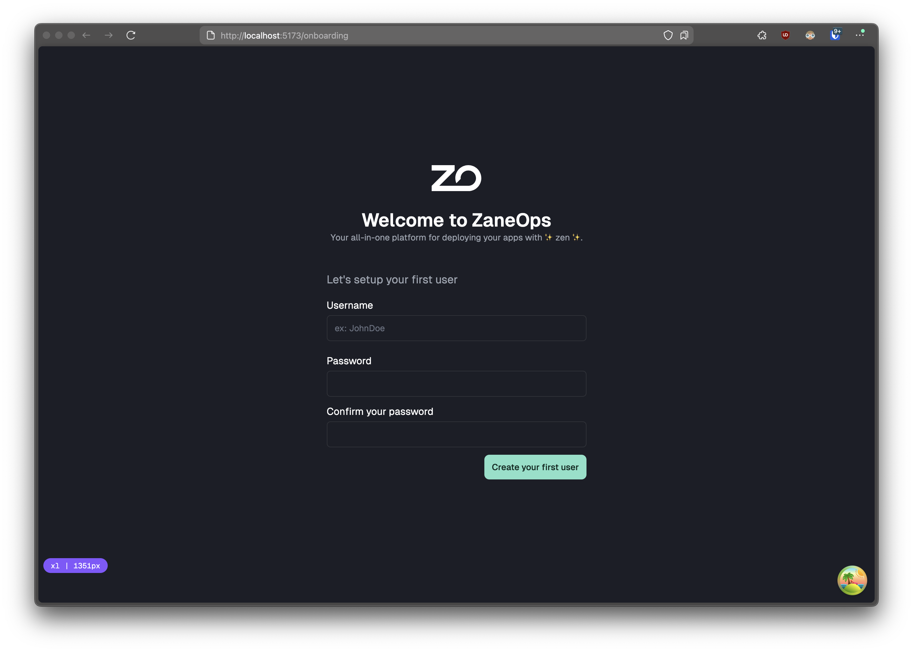
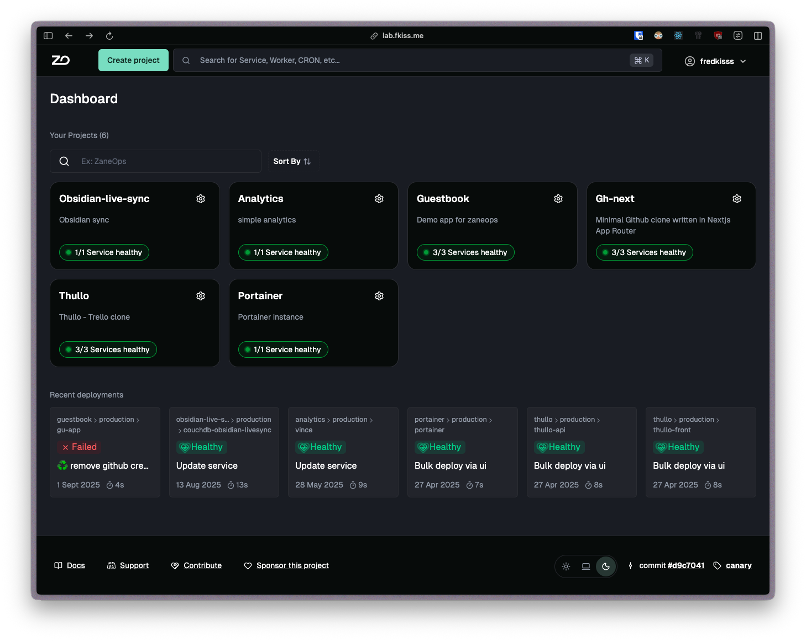
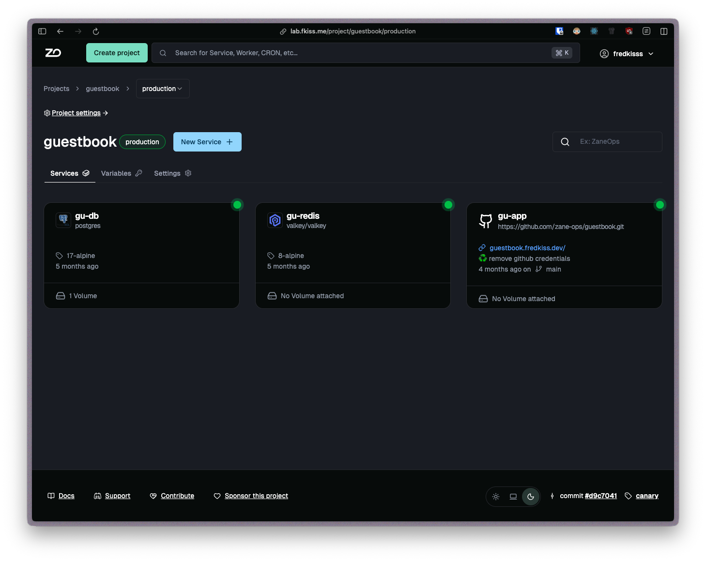

<p align="center">
  <picture>
    <source media="(prefers-color-scheme: dark)" srcset="images/ZaneOps-HORIZONTAL-WHITE.svg">
    <source media="(prefers-color-scheme: light)" srcset="./images/ZaneOps-HORIZONTAL-BLACK.svg">
    
  </picture>
</p>

<div align="center">
<p >
your all-in-one self-hosted platform for deploying apps with ✨ zen ✨.
</p>

<picture>
 <source media="(prefers-color-scheme: dark)" srcset="https://zaneops.dev/images/project-detail-dark.png">
    <source media="(prefers-color-scheme: light)" srcset="https://zaneops.dev/images/project-detail-light.png">

</picture>


</div>

<!--  -->


## What is ZaneOps ?

ZaneOps is a **beautiful, self-hosted, open-source** platform for hosting static sites, web apps, databases, services (like Supabase, WordPress, Ghost), workers, or anything else you need—whether you're launching a startup or managing an enterprise.  

It is a **free** and **open-source** alternative to platforms like **Heroku**, **Railway**, and **Render**, leveraging the **scalability** of [Docker Swarm](https://docs.docker.com/engine/swarm/) and the **flexibility** of [Caddy](https://caddyserver.com/).  


## 🚀 Installation

You can install zaneops like this :

```shell
# create a folder for installing ZaneOps
mkdir -p /var/www/zaneops
cd /var/www/zaneops

# download the ZaneOps "cli"
curl https://cdn.zaneops.dev/makefile > Makefile
make setup 
make deploy
```

> [!NOTE]
> If you have any issue, be sure to checkout the [instructions steps](https://zaneops.dev/installation/) in the documentation for more detailled setup.

## 📸 Some Screenshots

You can view all the in-app screenshots in the [documentation](https://zaneops.dev/screenshots/), but here's a quick showcase:


1. Onboarding

  <p align="center">
    <picture>
      <source media="(prefers-color-scheme: dark)" srcset="./images/create-user-dark.png">
      <source media="(prefers-color-scheme: light)" srcset="./images/create-user-light.png">
      
    </picture>
  </p>

2. Login

  <p align="center">
    <picture>
      <source media="(prefers-color-scheme: dark)" srcset="./images/login-dark.png">
      <source media="(prefers-color-scheme: light)" srcset="./images/login-light.png">
      
    </picture>
  </p>

3. Dashboard

  <p align="center">
    <picture>
      <source media="(prefers-color-scheme: dark)" srcset="./images/dashboard-dark.png">
      <source media="(prefers-color-scheme: light)" srcset="./images/dashboard-light.png">
      
    </picture>
  </p>

4. Creating a Project


  <p align="center">
    <picture>
      <source media="(prefers-color-scheme: dark)" srcset="./images/create-project-dark.png">
      <source media="(prefers-color-scheme: light)" srcset="./images/create-project-light.png">
      
    </picture>
  </p>

5. Project detail

  <p align="center">
    <picture>
      <source media="(prefers-color-scheme: dark)" srcset="./images/project-detail-dark.png">
      <source media="(prefers-color-scheme: light)" srcset="./images/project-detail-light.png">
      
    </picture>
  </p>

## ❤️ Contributing

Interested in contributing? Check out the [contribution guidelines](./CONTRIBUTING.md).

## 🙏 Credits

- [Plane](https://github.com/makeplane/plane): for giving us content for the contributions templates (contribution
  guidelines).
- [Coolify](https://github.com/coollabsio/coolify) which we used inspired ourselves from a lot.