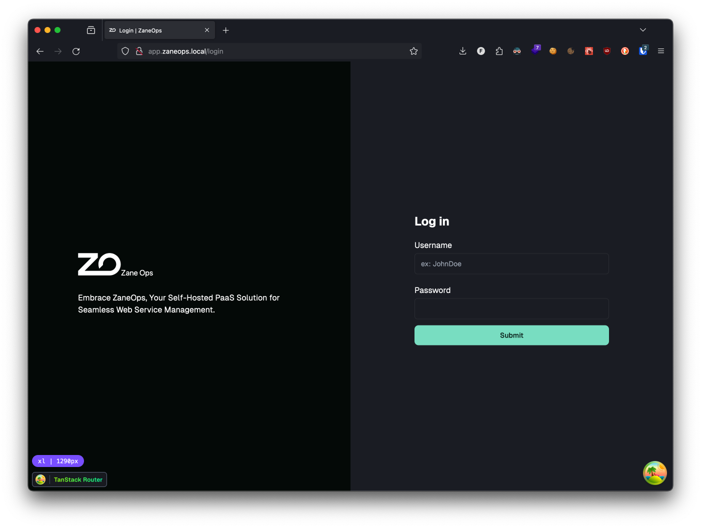
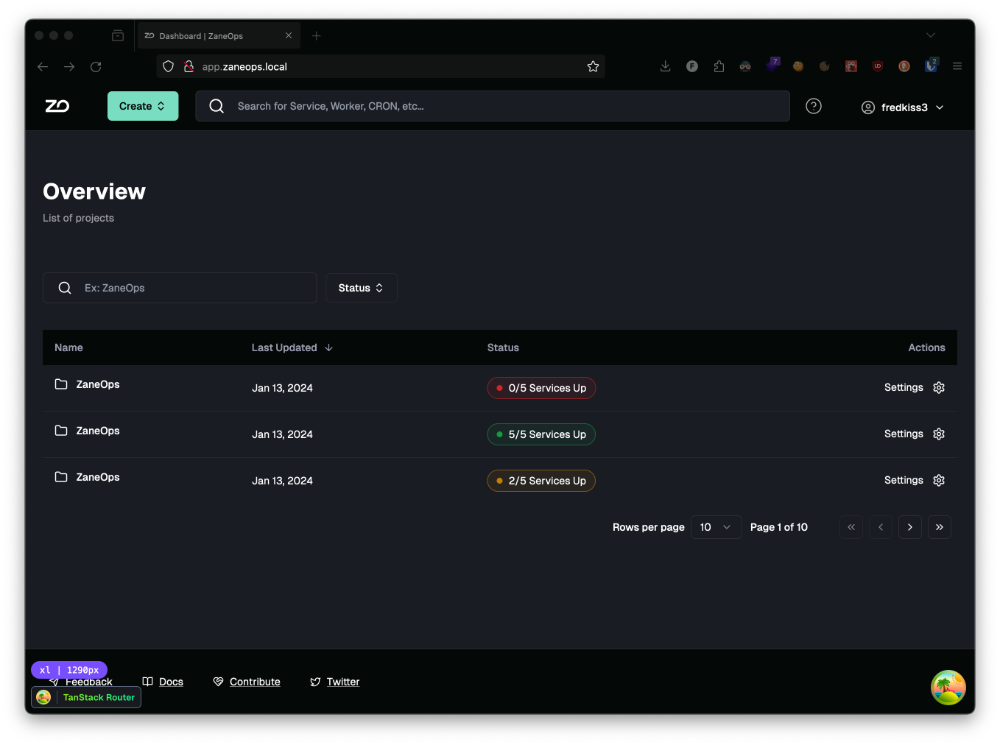

  <picture>
    <source media="(prefers-color-scheme: dark)" srcset="images/ZaneOps-SYMBOL-WHITE.svg">
    <source media="(prefers-color-scheme: light)" srcset="./images/ZaneOps-SYMBOL-BLACK.svg">
    
  </picture>

# 
Zane Ops

### 
A self-hosted PaaS for your web services, databases, CRONs, and everything you need for your next startup.

---

## 📸 Screenshots

- **Login** :

  <picture>
    <source media="(prefers-color-scheme: light)" srcset="./images/screen-login-light.png">
    <source media="(prefers-color-scheme: dark)" srcset="./images/screen-login-dark.png">
    
  </picture>

- **Dashboard** :

  <picture>
    <source media="(prefers-color-scheme: light)" srcset="./images/screen-dashboard-light.png">
    <source media="(prefers-color-scheme: dark)" srcset="./images/screen-dashboard-dark.png">
    
  </picture>

> *TODO: More Screenshots will be added once available.*

## 🚀 Features

- **Deploy Web Services**: Unleash your creativity by deploying web apps, starting a REDIS instance, creating a
  PostgreSQL database, initiating a Bitcoin node, and more. It's your resources, go crazy!
- **Git Push Deployment**: Automatically deploy apps from GitHub on push.
- **Preview Deployments**: Easily manage app versions, roll back to any version at any time, and control storage
  duration—whether indefinitely or temporarily post-merge.
- **Deploy Static websites**: Using your favorite SSG framework.
- **Deploy CRONs**: Automate recurring tasks by pinging endpoints or running commands regularly.
- **Scaling**: Effortlessly scale your app to manage traffic spikes, up or down accross multiple servers even.

## 🍙 Getting Started

1. **Setup**
   > *TODO: A quick-start tutorial will be provided.*

2. **Usage**
   > *TODO: A quick-start tutorial will be provided.*

## 📚 Terminologies

- **Service**: A persistent, scalable component of an application that runs continuously. Services act as the unit of your application, managing HTTP requests, executing background jobs, interfacing with databases, and more.

- **CRON**: A scheduling system for executing tasks (known as CRON jobs) at specified times or intervals. There are two
  types of CRON jobs:
    - **Command CRONs**: These jobs execute specific commands or scripts at predetermined times or intervals.
    - **HTTP CRONs**: These jobs make HTTP requests to specified URLs at set times or intervals, useful for triggering
      webhooks or remote tasks.

- **Preview Deployment**: A temporary deployment of a particular version of your application for testing and review purposes before it goes live. Preview deployments facilitate quality assurance, stakeholder review, and integration testing, enabling feedback and adjustments without impacting the production environment.

## ❤️ Contributing

Interested in contributing? Check out the [contribution guidelines](./CONTRIBUTING.md).

## 📝 Docs

You can access the documentation [here](./docs/).

## Credits

- [Plane](https://github.com/makeplane/plane): for giving us content for the contributions templates (contribution
  guidelines).
- [Coolify](https://github.com/coollabsio/coolify): We inspired ourselves a lot from it.
- [Railway](https://railway.app/): We also inspired ourselves a lot from it.