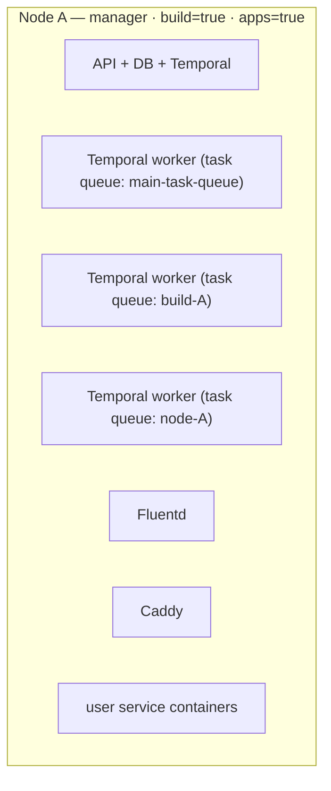
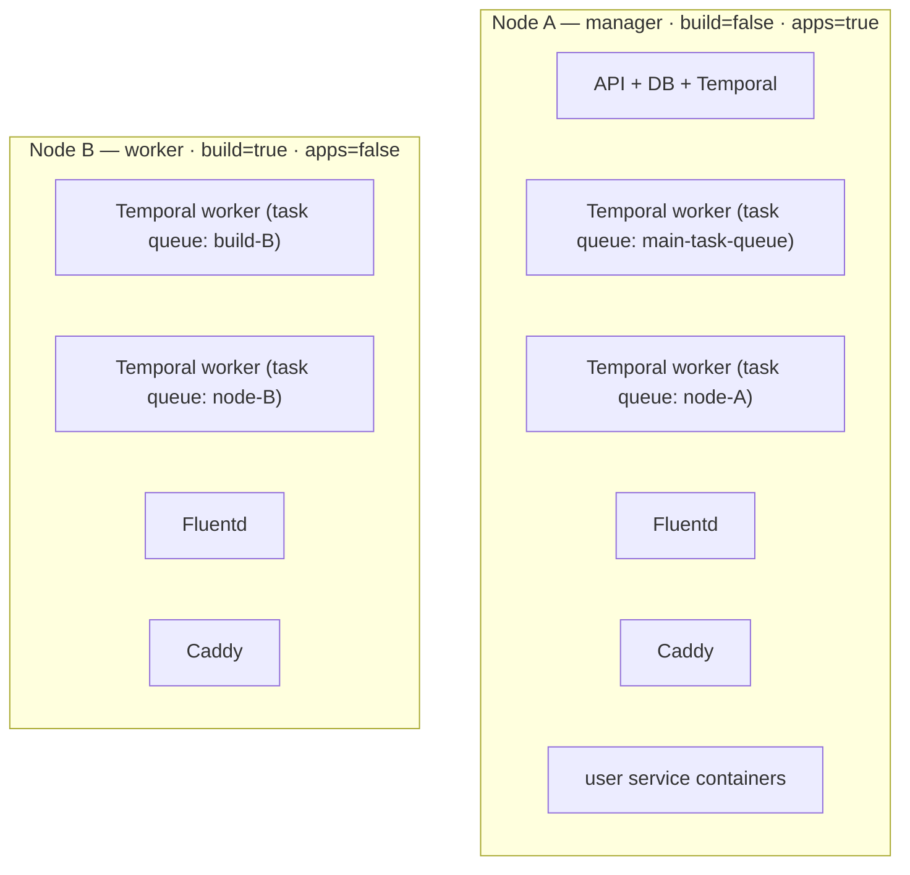
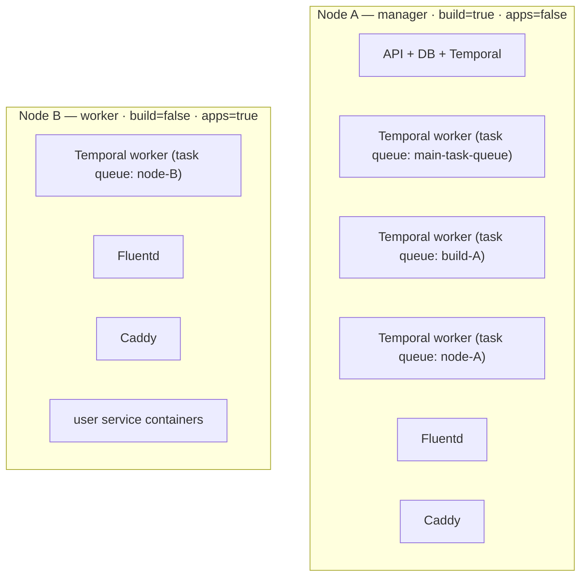
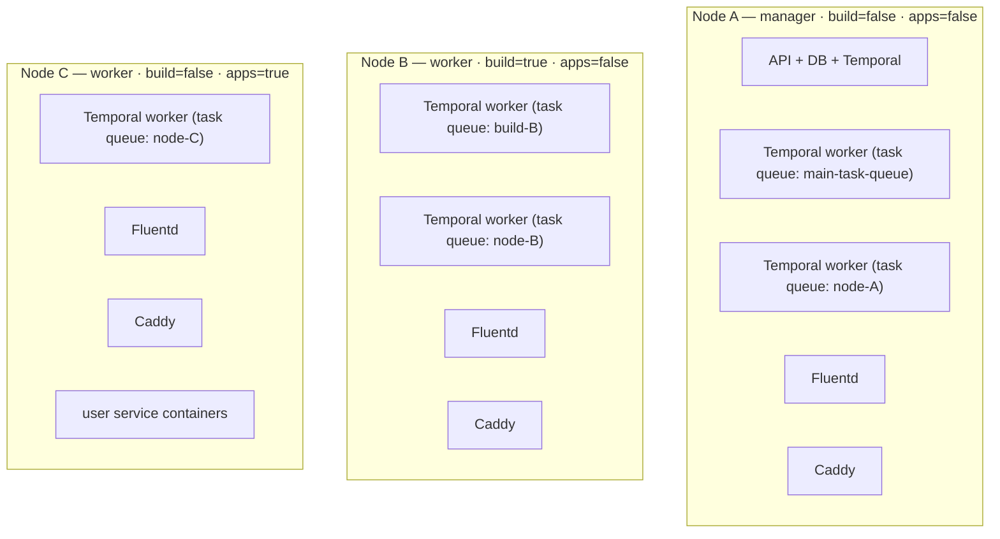
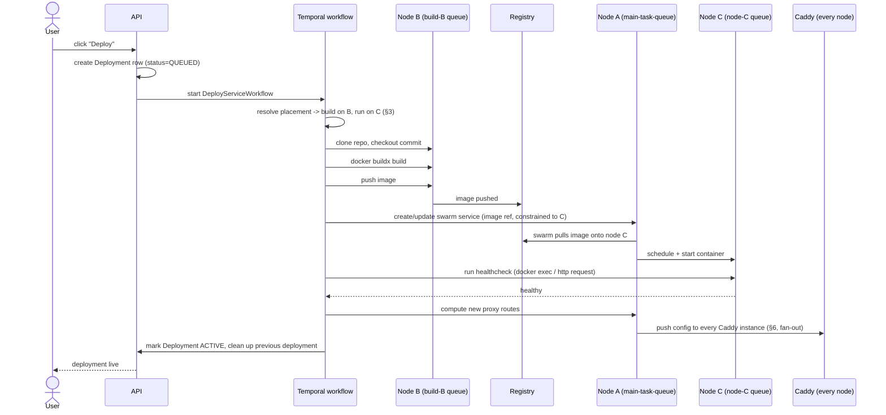
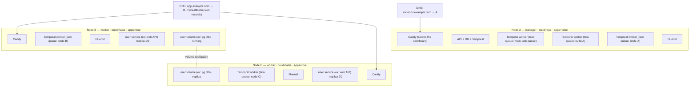

# Multi-server — Implementation Plan

Status: **in design**. Branch `feat/multi-server`. Tracking issue: [#446](https://github.com/zane-ops/zane-ops/issues/446).

**What we want:** run ZaneOps across more than one machine — extra machines ("nodes") that run user services, extra machines that build images — while keeping the single-machine install working exactly as it does today.

**Hard requirement (from the issue thread):** 1 node, 2 nodes, 3 nodes must all work. No 3-node minimum, no forced shared storage. Replicated storage (data copied across multiple machines) is an *addon*, never a requirement.

---

## Glossary <a id="sec-glossary"></a>

Terms used throughout this doc, defined once here instead of re-explained every time they come up.

| Term | Meaning |
| --- | --- |
| **Node** | one machine (physical or virtual) in the cluster. |
| **Docker Swarm** | Docker's built-in clustering system — turns several machines into one pool that runs containers. |
| **Manager / worker** | the two roles a Swarm node can have. Managers make scheduling decisions and hold the cluster's state; workers just run containers. Losing a worker only affects what was running on it; losing too many managers can take the whole cluster down. |
| **Docker socket** | the local API Docker exposes on a machine. Having access to it means you can control every container on that machine — so who gets access to which machine's socket is a real security boundary. |
| **Temporal** | the job-queue/workflow system ZaneOps uses for anything long-running (deploying a service, provisioning a node, etc). |
| **Workflow (Temporal)** | one multi-step process, e.g. "deploy this service." |
| **Activity (Temporal)** | one single step inside a workflow, e.g. "clone the repo" or "create the Swarm service." |
| **Task queue (Temporal)** | a named list of pending activities. A worker only picks up activities sent to the queue(s) it's listening on — this is how ZaneOps decides which machine a given activity runs on. |
| **Global service (Swarm)** | a Swarm service configured to run exactly one copy on every node that matches its rules, automatically adding/removing copies as nodes join or leave. |
| **Placement constraint** | a rule telling Swarm which node(s) a service is allowed to run on (e.g. "only nodes labeled `zane.build=true`"). |
| **Overlay network** | the private virtual network Swarm creates so containers on different physical machines can reach each other as if they were on the same local network. |
| **Routing mesh** | Swarm's built-in traffic forwarding: any node can accept a request on a published port and forward it to a healthy container, even if that container is actually running on a different node. |
| **Registry (container registry)** | a server that stores built container images so any machine can download (`pull`) them. |
| **Buildx / buildkit** | Docker's image-building engine, used here inside a plain container rather than needing Swarm/manager access. |
| **Volume** | a folder on disk that a container's data is stored in, so it survives container restarts. Tied to whichever machine it was created on unless explicitly copied elsewhere. |
| **DRBD / Linstor** | DRBD (Distributed Replicated Block Device) is a Linux kernel module that mirrors a disk over the network to another machine in real time — RAID-1, but across servers. Linstor is the management layer on top that creates DRBD resources and exposes them as Docker volumes. Works with 1 or 2 nodes, unlike Ceph which needs 3. Optional addon for replicating user volumes ([§7](#sec-7), [§14](#sec-14)). |
| **Quorum** | the minimum number of managers that must agree before the cluster accepts a change — the reason you'd want e.g. 3 managers instead of 1: the cluster keeps working even if it loses one. |
| **Replica** | one running copy of a service; a service can have several replicas spread across nodes for redundancy. |
| **Load balancing** | spreading incoming traffic across multiple servers instead of sending it all to one — both to share the load and so traffic can keep flowing if one server is down. There are many ways to do it (a dedicated load-balancer box, DNS, etc); this doc picks DNS (below) for the reasons in [§6(c)](#sec-6). |
| **Health check** | a periodic "are you still alive?" probe used to decide whether to keep sending traffic/work to a server or container. |
| **DNS record** | an entry mapping a domain name to a server's address. A domain can have several records (one per server); a *health-checked* DNS provider uses health checks to stop handing out a record for a server that's currently down — this is the form of load balancing this plan relies on for Caddy. |

---

## 1. What already exists <a id="sec-1"></a>

Some of the hardest prerequisites are already in the tree. Worth knowing before planning work that duplicates them.

| Piece | Where | Status for multi-node |
| --- | --- | --- |
| Build registry (local disk or S3) | [container_registry/models.py:60](../container_registry/models.py#L60) | ✅ **done** — built images are already pushed to a registry reachable over the `zane` overlay network, so any node can pull them. This was the biggest blocker and it is solved. |
| Per-worker task queue via env | [settings.py:456](../backend/settings.py#L456), [worker.py:67](../temporal/worker.py#L67) | ✅ the plumbing for per-node queues (a way to tell Temporal "run this job on that specific machine") is there; only the routing logic is missing |
| `swarm` app + `ServerNode` model | [swarm/models.py](../swarm/models.py) | 🚧 scaffolded, needs rework (see [§3](#sec-3)) |
| SSH keys + SSH-into-server terminal | [webshell/models.py:8](../webshell/models.py#L8), [server_terminal.py](../webshell/consumers/server_terminal.py) | ✅ reusable for setting up new nodes and running remote `docker exec` commands |
| `zane.role: proxy` label | [docker-stack.prod.yaml:53](../../docker/docker-stack.prod.yaml) | ✅ already labelled |
| Buildx builders (the thing that actually builds Docker images) | [git_activities.py:606](../temporal/activities/git_activities.py#L606) | ✅ they are **local `docker buildx` containers**, not Swarm services — see [§4](#sec-4), this matters for who is allowed to build |
| Swarm service metrics | [helpers.py:754](../temporal/helpers.py#L754) | ⚠️ only checks the *local* machine, so it only sees containers running on the manager |

Everything in `docker-stack.prod.yaml` is currently pinned to `node.role==manager` (i.e. it only ever runs on the manager machine). That stays true for the control-plane pieces (API, DB, Temporal, etc).

---

## 2. The three decisions that shape everything else <a id="sec-2"></a>

### 2.1 Do NOT expose the manager's Docker socket to other nodes <a id="sec-2-1"></a>

A "Docker socket" is basically the API that lets you control Docker on a machine — if you have access to it, you can do almost anything on that machine. The original notes proposed connecting each remote build machine to the manager's Docker socket over a secure connection (TLS). I'd argue against it:

- it hands out full, root-level control of the whole cluster to every build machine
- it needs certificates, certificate rotation, and firewall rules — all things we'd have to build and maintain ourselves
- if one build machine gets compromised, the whole cluster is compromised

**Instead: split the work by what it actually needs.** Temporal lets you assign each individual job ("activity") to a specific queue, which is exactly the tool for this.

| Kind of job | Needs | Runs on queue |
| --- | --- | --- |
| Swarm changes — creating/updating/removing services, networks, configs, volumes | access to the manager's Docker API | `main-task-queue` (the manager's own worker, using its own local Docker) |
| Database / proxy / registry / Caddy config changes | nothing machine-specific | `main-task-queue` |
| Cloning code, detecting the build method, running `docker buildx build`, pushing the image | a local Docker socket + local disk on *that* machine | `build-<node>` (that node's own worker) |
| Reading local info — container metrics, `docker exec`, disk usage | a local Docker socket | `node-<node>` |
| Local writes we missed at first pass — pulling an image, running a custom-command healthcheck, pruning images/volumes/containers/networks/build-cache | a local Docker socket, on whichever machine the service/build actually lives on | `node-<node>` or `build-<node>`, not `main-task-queue` |

No machine ever needs remote access to another machine's Docker. Each worker only ever talks to its *own* local Docker socket.

**Audit done (2026-09-11):** went through `git_activities.py` end-to-end — it never touches the Swarm API. Every Docker interaction there is local: shelling out to `docker buildx build`/`push`, `docker login` via subprocess, and a `self.docker_client` that's assigned but never actually called. So the build path is clean, confirming [§2.1](#sec-2-1)'s core claim. Resolves open question #2 ([§11](#sec-11)) — **no**.

However, `main_activities.py` isn't purely swarm-mutation code the way the table above implies — it also has local-socket-only calls bundled into the *same* classes as the manager-only ones, which the table above didn't account for:
- [main_activities.py:1225](../temporal/activities/main_activities.py#L1225) `pull_image_for_deployment` — `docker_client.images.pull(...)`, a local pull, not a Swarm call
- [main_activities.py:1598](../temporal/activities/main_activities.py#L1598) `run_deployment_healthcheck` — `docker_client.containers.get(...)` + `exec_run(...)` for custom command healthchecks, assumes the container is on this same machine
- `DockerSystemPruneActivities` (main_activities.py:192-309) — `images.prune`, `volumes.prune`, `containers.prune`, `networks.prune`, plus buildx cache pruning — all local-machine housekeeping

None of these need manager/cluster privileges, but they do assume "this worker == the machine the service/build actually lives on," which only holds today because everything runs on the manager. Once services/builds can live on other nodes, these three need to move to that node's queue (`node-<node>` or `build-<node>`), not stay on `main-task-queue`. Not a blocker for [§2.1](#sec-2-1)'s security argument, but it enlarges the scope of phases 4 and 5 — add "split out `pull_image_for_deployment`, `run_deployment_healthcheck`'s container calls, and `DockerSystemPruneActivities`" as an explicit task there.

### 2.2 One "node worker" per node, not a whole separate program <a id="sec-2-2"></a>

The original notes proposed running a separate small monitoring program (like Portainer's "agent") on every node just to check health/metrics. That means building, shipping, upgrading, and securing a second piece of software — extra work for little benefit.

**Instead: run the existing ZaneOps app image as a service on every node**, each running its own Temporal worker listening on a queue named `node-<hostname>`. It already knows how to talk to the database and Temporal, it already has the Docker socket, and `make upgrade` already updates it. So "is this node allowed to build?" just becomes a label on the node, not a different program to install.

For checking whether a node is alive, we don't even need a special worker — `docker node ls` (a normal Swarm command) already tells the manager a node's `Status`, `Availability`, and `ManagerStatus`. We can just poll that on a schedule.

#### The existing `schedule-task-queue` worker goes away <a id="sec-2-2-1"></a>

Today the manager runs a second worker on `schedule-task-queue` ([docker-stack.prod.yaml:249](../../docker/docker-stack.prod.yaml#L249)) that all Temporal schedules are created against ([client.py:167](../temporal/client.py#L167)). Everything it runs is node-local work — exactly what `node-<hostname>` is for — so it's replaced by the node worker rather than kept as a fourth container:

| Scheduled workflow | Needs | Moves to |
| --- | --- | --- |
| `monitor-docker-deployment` (healthchecks), `get-docker-deployment-stats` (metrics) | the socket where the container runs | `node-<hostname>` of the deployment's node |
| `monitor-compose-stack`, `collect-compose-stack-metrics` | same, per stack | `node-<hostname>` (fan-out if a stack spans nodes) |
| `monitor-registry-deployment` | manager socket | `node-<manager>` |
| `docker-system-prune` | every socket | one schedule per node, each on its own `node-<hostname>` |
| `cleanup-app-data`, `check-license` (ee) | nothing machine-specific | `node-<manager>` |

What that changes in code:
- `TEMPORALIO_SCHEDULE_TASK_QUEUE` is removed; `create_schedule` / `create_or_update_schedule` take an explicit `task_queue` instead of defaulting to it.
- Per-deployment schedules ([main_activities.py:1949](../temporal/activities/main_activities.py#L1949)) are already recreated on every deploy, so they naturally follow the service if it lands on a different node.
- Global schedules ([setup_automated_schedules.py](../temporal/management/commands/setup_automated_schedules.py), [console/views/system.py](../console/views/system.py)) resolve the manager's queue via `ServerNode.objects.get(is_self=True).node_task_queue`.
- Upgrade path: schedules still pointing at `schedule-task-queue` must be recreated — `setup_automated_schedules` already deletes obsolete schedules, so that's the hook.

Net: a 1-node manager runs `main-task-queue`, `build-<A>`, `node-<A>` — three workers, not four.

### 2.3 Worker nodes CAN build images <a id="sec-2-3"></a>

The GitHub issue originally said "worker nodes will not be able to run builds." But since building only needs a local Docker socket + local disk (not manager-level cluster control, per [§2.1](#sec-2-1)), that restriction isn't actually necessary — a plain worker node can build images just fine.

**Recommendation: keep two separate concepts apart.**
- `node.role` (manager/worker) — Swarm's own concept, about who has voting/cluster-control power
- `zane.build=true` — a label meaning "ZaneOps is allowed to schedule builds here"
- `zane.apps=true` — a label meaning "ZaneOps is allowed to run user services here"

That way, a 2-machine setup can be "1 manager doing everything + 1 worker that only does builds" — probably the most common real-world setup — without forcing anyone to add a second manager.

Still, we should document the general guidance around Swarm quorum (why you'd want an odd number of managers, and why 3 managers is the real "high availability" setup) — and add a warning that's specific to us: since our nodes are expected to be scattered across different hosting providers and regions rather than one datacenter, putting multiple managers far apart geographically can make the cluster *less* stable, not more (slower to agree on changes, more likely to briefly lose quorum on a network blip).

---

## 3. Data model <a id="sec-3"></a>

Rework [swarm/models.py](../swarm/models.py). The current draft has some leftover copy-paste issues (`ID_PREFIX = "tok_"` copied from the tokens feature, missing the shared `TimestampedModel` base, and no way to describe what a node is capable of).

```python
class ServerNode(TimestampedModel):
    ID_PREFIX = "node_"

    class Role(models.TextChoices):
        MANAGER = "MANAGER", _("Manager")
        WORKER  = "WORKER",  _("Worker")

    class Status(models.TextChoices):
        PROVISIONING = "PROVISIONING", _("Provisioning")
        READY        = "READY",        _("Ready")
        DOWN         = "DOWN",         _("Down")
        DRAINED      = "DRAINED",      _("Drained")
        FAILED       = "FAILED",       _("Failed")

    hostname       = models.CharField(unique=True)   # == swarm node Description.Hostname
    swarm_node_id  = models.CharField(unique=True)
    role           = models.CharField(choices=Role.choices)
    private_ip     = models.GenericIPAddressField()  # overlay / VPC address
    public_ip      = models.GenericIPAddressField(null=True)
    docker_version = models.CharField()
    status         = ...
    is_build_node  = models.BooleanField(default=False)
    is_app_node    = models.BooleanField(default=True)
    is_self        = models.BooleanField(default=False)   # the original manager, from the initial install
    ssh_key        = models.ForeignKey(SSHKey, on_delete=models.SET_NULL, null=True)
    ssh_user       = models.CharField(default="root")
    ssh_port       = models.PositiveIntegerField(default=22)
    cpus           = models.PositiveIntegerField(null=True)
    memory_bytes   = models.BigIntegerField(null=True)
    last_seen_at   = models.DateTimeField(null=True)

    @property
    def build_task_queue(self) -> str: return f"build-{self.hostname}"
    @property
    def node_task_queue(self)  -> str: return f"node-{self.hostname}"
```

**Migration for existing installs:** a data migration will automatically create one `ServerNode` row with `is_self=True`, reading the hostname/id straight from `docker.info()`. So every existing install instantly becomes a valid "1-node cluster" with no action needed from the user.

### Placement targeting (i.e. "which machine should this run on?")

Three levels, checked from most specific to least specific:

```
Service.node_placement  →  Environment.default_node_placement  →  Project.default_node_placement  →  ANY
```

Each of Service/Environment/Project stores a small choice field plus an optional link to a specific node:

| `placement_strategy` | Meaning |
| --- | --- |
| `ANY` | no constraint, Swarm decides |
| `ANY_APP_NODE` | any node labeled `zane.apps==true` |
| `SPECIFIC` | must run on `node.hostname==<placement_node.hostname>` |
| `PINNED_BY_VOLUME` | not chosen by the user — see [§6](#sec-6), happens automatically when a service has saved data on a specific machine |

All of this gets resolved into an actual Swarm placement constraint in one place: [main_activities.py:1400](../temporal/activities/main_activities.py#L1400).

---

## 4. Build routing (Temporal) <a id="sec-4"></a>

Two modes, both needed.

**Explicit (the main case).** The deployment already knows which machine it should build on (from the placement rules above, or a manual override). The workflow just sends every build-related job to `task_queue=node.build_task_queue`. Simple and predictable — and it's exactly what "deploy this project on that specific server" needs anyway.

**Auto (fallback), used when placement is `ANY`.** We can use a known Temporal pattern called [worker_specific_task_queues](https://github.com/temporalio/samples-python/tree/main/worker_specific_task_queues): every build-capable worker also listens on one shared queue called `build-router`. A tiny first job goes out on that shared queue, and whichever worker happens to pick it up replies with its own personal queue name. The workflow then sends every following job in that same build to that specific worker's queue. So whichever machine is free grabs the job, and the rest of that build stays on that same machine.

Either way, the important rule stays the same: **every step of one build/deployment that touches the filesystem runs on the same machine.** That matters because the temporary folder used during a build ([`tmp_dir`, git_activities.py:370](../temporal/activities/git_activities.py#L370)) only exists on whichever machine created it — if a later step ran on a different machine, that folder wouldn't be there. This way we avoid needing shared storage (like S3) just for temp files, or re-cloning the repo at every step.

**On failure:** if a build fails, we do **not** try to retry it on a different machine — it just fails, and the user retries manually. This matches how it works today, keeps the change smaller, and was explicitly agreed on in the GitHub issue.

**Worker deployment:** the build worker will be a global Swarm service (meaning: one copy runs automatically on every eligible machine) restricted to nodes labeled `zane.build==true`. Its queue name needs to be based on the machine's own hostname — Swarm can fill in `{{.Node.Hostname}}` in an environment variable for us, which should work for this. Worth testing early; if it doesn't work, the fallback is to have `run_worker.sh` figure out the hostname itself at startup with `$(hostname)`.

---

## 5. Fluentd (log collection) — one setup, running identically everywhere <a id="sec-5"></a>

**Today:** there's one Fluentd (log collector) running on the manager, and every container is told to send its logs to a specific file path on disk (a "unix socket") at `${ZANE_APP_DIRECTORY}/.fluentd/fluentd.sock` ([main_activities.py:1444](../temporal/activities/main_activities.py#L1444)). If a container ran on a different machine, it would be pointing at a socket file that doesn't exist there — logging would break.

**Fix:** make `zane-fluentd` a **global service** (one copy automatically on every machine) and make sure every machine has that same file path set up. Since each machine evaluates that address locally, the *exact same* config keeps working with **zero code changes** — it just now works correctly everywhere because there really is a matching Fluentd on every machine.

This is why "ZaneOps must be installed at the exact same folder path on every machine" is a real, enforced requirement — not just a nice-to-have — and the setup process for adding a new node needs to guarantee it.

This also means we don't need the more complicated idea (from the original notes) of routing logs through Caddy to reach Fluentd — drop that. Each machine's Fluentd still sends logs the same way it does today, over the internal network to the central API, so there's still just one place logs get collected, and Loki (log storage/search) doesn't need to change at all.

---

## 6. Proxy (Caddy) — the part most likely to be underestimated <a id="sec-6"></a>

Making Caddy (the reverse proxy that routes web traffic to services) run on every machine is the easy part. Two things behind that are not.

**(a) Certificates.** Each Caddy instance needs to see the TLS certificates the others have already gotten — otherwise, each one will try to request its own certificate for the same domain and we'll hit Let's Encrypt's rate limits. Fix: use a plugin called [caddy-storage-redis](https://github.com/pberkel/caddy-storage-redis), pointed at the **Redis-compatible cache we already run** (`zane.valkey`) over the internal network.

I'd push back on the original notes' idea of "one Redis per server, clustered together" — for now, having a single shared cache (matching the manager) is fine, because the database, Temporal, and the API already only exist on the manager anyway — if the manager goes down, cert renewal is the least of our problems. We can add real Redis replication later, as part of a dedicated "high availability" phase. This does require rebuilding `docker/proxy/Dockerfile` to include the plugin.

A Valkey outage doesn't take down already-running, already-certified traffic (Caddy keeps serving certs it already loaded from memory) — it only blocks issuing a brand-new cert or a renewal landing exactly during that window. Acceptable given the "rest of ZaneOps can go down sometimes" scoping.

**(c) The external entry point — how traffic finds a surviving Caddy.** Even with every Caddy instance healthy and in sync, something outside the cluster decides which one a client connects to, and that has to keep working when one node is down — this is a load-balancing problem (see glossary). Since our nodes are scattered across different hosting providers and regions (no shared private network to rely on for IP failover), the approach is: **DNS with one address per app node, via a DNS provider that can check which ones are alive** (e.g. Route53 health checks, NS1, Cloudflare) and stops sending traffic to a dead one. Concretely this means surfacing each app node's public IP in the UI so users can add their own DNS records, and documenting a recommended provider/setup — ZaneOps does not manage DNS on the user's behalf.

**(b) Keeping every Caddy instance's config in sync — this is the actual hard part.** Right now, the API pushes routing changes to a single Caddy admin address, `http://zane.proxy:2019` ([settings.py:426](../backend/settings.py#L426)), using a "only apply if nothing else changed since I last read it" safety check (etag-based concurrency, see [proxy.py:16](../temporal/proxy.py#L16)). Once there are multiple Caddy instances behind one shared address, each update would only land on *one* of them at random, and the rest would silently fall out of sync.

Two ways to solve this:
1. **Send every change to every instance.** Switch `zane-proxy` to a mode (`endpoint_mode: dnsrr`) that lets us look up the IP of every single instance, then apply each config change to all of them individually. We already have most of the code needed to find those IPs: [`get_swarm_service_aliases_ips_on_network`](../temporal/helpers.py#L414). Downside: more requests per change, and we need to handle partial failures (what if it succeeds on 2 out of 3 machines?) and repeat that "safety check" retry logic per machine.
2. **One "leader" instance, others just copy it.** Keep a single Caddy on the manager as the source of truth, and have the rest load config from it. Caddy doesn't have a built-in way to do this, so we'd have to write our own syncing logic from scratch.

**Recommendation: option 1**, plus a periodic background job that checks each instance's actual config against what it *should* be, and fixes any mismatch. That also handles the case where a brand new machine joins after a config change already happened.

We should budget real time for this — it's the piece most likely to take longer than expected.

---

## 7. Volumes and storage <a id="sec-7"></a>

**For v1: stickiness, not real replication.** Meaning: if a service saves data to disk (a `Volume`, see [main.py:1662](../zane_api/models/main.py#L1662)), it will always be forced to run on the *same* machine it first ran on — not copied across machines.

- add a new field, `Volume.node`, linking to the `ServerNode` it landed on when it first deployed
- during placement resolution, a service with a volume tied to a node is automatically treated as `PINNED_BY_VOLUME`, which overrides any `ANY` setting
- show this clearly in the UI: "this service is pinned to node X because it has volumes"
- if someone wants to move that data to a different machine later, that has to be an explicit, manual action (stop the service, copy files over SSH, point it at the new machine, redeploy) — not something automatic

Note that `SharedVolume` ([main.py:1702](../zane_api/models/main.py#L1702)) is a *different* feature — it lets one service read another service's volume. With multiple machines, this means: if service A shares its volume with service B, then B must also be pinned to the same machine as A. We need to handle that when resolving placement.

**Later (not in v1): real replicated storage as an optional addon.** People discussing the GitHub issue converged on **Linstor/DRBD** rather than **Ceph** for this, for a good reason: Linstor works fine on a single machine and can expand to more, while Ceph needs at least 3 machines from day one — which breaks our "must work with 1 node" requirement.

Some commenters suggested we should prepare the folder structure for this on *every* install now (even single-node ones) to avoid a painful migration later. I'd hold off on that for v1 — it would mean installing extra kernel-level software (`drbd-dkms`) on every existing single-node install, for a feature most people won't ever use. Instead: just reserve the naming convention now (`/var/lib/zaneops/volumes/<volume_id>`), and start putting new volumes there. Turning on "replicated storage" later then only touches the storage layer underneath an already-stable path — same end result, without forcing extra software onto people who don't want it.

**Not covered by this plan, just documented:** moving app data to S3, or database replication setups. Those are considered the user's/template's own concern, per the discussion in the issue.

---

## 8. Shells and metrics on remote machines <a id="sec-8"></a>

Both of these currently assume everything is running locally, on the same machine as the API.

| Feature | Today | With multiple machines |
| --- | --- | --- |
| Opening a shell into a deployed container | `docker.from_env()` + `exec`, run locally ([container_terminal_consumer.py:29](../webshell/consumers/container_terminal_consumer.py#L29)) | look up which machine the container is actually running on (via the Swarm API), then SSH into that machine and run `docker exec` there — reusing the pattern already built in [server_terminal.py](../webshell/consumers/server_terminal.py) |
| Opening a shell into the server itself | SSH using a stored `SSHKey` | same as today, just let the user pick which machine in the UI |
| Container metrics (CPU/memory usage etc.) | read from the local socket ([helpers.py:826](../temporal/helpers.py#L826)) | run the same metrics-collecting job on each machine's own `node-<hostname>` queue, then combine the results |
| Picking which replica to connect to | doesn't exist yet | new UI: list all running copies of a service along with which machine each is on, let the user pick one |

Using SSH for remote shell access is a deliberate choice — it reuses infrastructure we already have, and doesn't require opening any new network port beyond the standard SSH port (22). The tradeoff is that it depends on SSH keys staying valid and reachable.

---

## 9. Setting up a new machine from the UI <a id="sec-9"></a>

This becomes a Temporal workflow, using SSH login details the user provides once.

1. connect via SSH, check the OS/CPU architecture/CPU count/memory, and confirm the manager can actually reach this machine's internal IP
2. install Docker if it's missing, and verify the version
3. create the ZaneOps folder **at the exact same path used on the manager**, and set up its config files (`.env`, `fluent.conf`, the Fluentd socket folder)
4. run `docker swarm join`, using a join token fetched from the manager, joining either as a manager or a worker
5. apply the right labels to the node (`zane.build`, `zane.apps`)
6. force-update the global services so Swarm notices the new machine and schedules things onto it
7. wait until Fluentd, the node worker, and the proxy are all reporting healthy on that machine
8. mark the `ServerNode` as `READY`

Each of these steps is written so it can safely be retried on its own — so if something fails partway through, we can resume instead of starting over. Removing a machine is basically the reverse: first do `docker node update --availability drain` (tell Swarm to stop scheduling new things there and move existing ones off), wait for that to finish, then remove it.

**Firewall:** Swarm itself needs certain ports open between machines: `2377/tcp` (for managers), `7946/tcp+udp`, and `4789/udp`. I'd recommend **not** having ZaneOps automatically configure the firewall (`ufw`) for the user in v1 — one wrong rule could lock the user out of their own machine over SSH, with no way for us to fix it remotely. Instead: clearly document the required ports, add a check that tells the user exactly which ports aren't reachable before they try to join a machine, and maybe add an opt-in "configure the firewall for me" button later.

---

## 10. Rollout phases <a id="sec-10"></a>

Each phase ends with a fully working cluster, so this can ship gradually instead of all at once.

| # | Phase | What's included | What becomes possible |
| --- | --- | --- | --- |
| 0 | Model + backfill | Rework `ServerNode`, auto-migrate every existing install into a valid 1-node cluster, add a read-only "list of nodes" screen in the UI | no visible behavior change yet |
| 1 | Node lifecycle | SSH-based setup workflow, joining/leaving/draining a machine, labels, port-reachability check, checking if a node is alive | you can add machines to the cluster; nothing runs on them yet |
| 2 | Multi-node data plane | Fluentd everywhere, Caddy everywhere + shared cert storage + **keeping every Caddy instance's config in sync** ([§6](#sec-6)), confirm image pulling works from a second machine | user services can actually run on any machine |
| 3 | Placement | Let Projects/Environments/Services choose where they run, volume pinning, `SharedVolume` handling, UI for picking a machine | users can choose where things run |
| 4 | Distributed builds | Split build jobs from cluster-control jobs ([§2.1](#sec-2-1)), per-machine build queues, both routing modes, global build worker service | builds no longer have to happen on the manager |
| 5 | Per-node operations | Node worker as a global service, combining metrics from all machines, SSH-based container shell, "pick a replica" UI, **move `pull_image_for_deployment`, `run_deployment_healthcheck`'s container calls, and `DockerSystemPruneActivities` off `main-task-queue`** (found during the [§2.1](#sec-2-1) audit — see below), **retire `schedule-task-queue` — all schedules target a `node-<hostname>` queue** ([§2.2](#sec-2-2-1)) | full visibility across all machines |
| 6 | Docs | Write a scaling guide: quorum (incl. the manager-spacing warning in [§2.3](#sec-2-3)), 1/2/3-machine setups, firewall rules, what counts as "high availability" and what doesn't | |
| 7 | User-service & proxy HA (see [§14](#sec-14)) | Multi-replica placement so Swarm can spread/reschedule stateless services, Linstor/DRBD for stateful ones, DNS-based external entry point for Caddy (surface node IPs in the UI + docs) | a user service (and the proxy in front of it) survives losing one node — without needing the API/DB/Temporal to be HA, which is explicitly out of scope |

Phase 2 is the riskiest one. We should start testing the Caddy config-syncing approach ([§6](#sec-6)) early — even before phase 1 is fully done — because if option 1 doesn't work out, it affects phases 2 through 5.

Phase 7 is arguably the actual point of "multi-server" (see [§14](#sec-14)) — it's listed last only because it depends on placement (phase 3) and the Caddy sync work (phase 2) already existing. Its two sub-pieces (replicated storage, DNS entry-point docs) don't depend on each other, though, and could start as soon as phase 3 lands rather than waiting for phases 4-6.

---

## 11. Open questions <a id="sec-11"></a>

1. Can we get Swarm's `{{.Node.Hostname}}` template to fill in a worker's queue name automatically, or do we need `run_worker.sh` to compute it itself at startup? (cheap to test, blocks [§4](#sec-4))
2. ~~Does any existing build-related job secretly call the Swarm API~~ — **resolved, no.** `git_activities.py` audited end-to-end (2026-09-11): no build activity touches `services`/`networks`/`configs`/`nodes`. See [§2.1](#sec-2-1) for the write-up and for a related gap found during the same audit (node-local activities currently mislabeled as manager-only).
3. Where should we record which machine a deployment was built on — a field directly on the `Deployment` model, or only inside the workflow's internal state? A dedicated field would make retries and the UI simpler — leaning toward that.
4. If the machine a service is pinned to goes down, should new deployments to it fail right away, or wait until it comes back? Leaning toward failing fast with a clear error message.
5. `MAX_CONCURRENT_DEPLOYS` ([settings.py:459](../backend/settings.py#L459)) currently limits the whole cluster at once. Should each build machine have its own limit instead?

---

## 12. Example setups <a id="sec-12"></a>

A quick reference for what actually runs where, at different cluster sizes. "Global service" below means a Swarm `mode: global` service — Swarm automatically runs one copy on every node that matches its placement constraint, and removes/adds copies as nodes join or leave.

Which ZaneOps pieces are global vs. manager-only, regardless of cluster size:

| Piece | Where it runs | Notes |
| --- | --- | --- |
| API + DB + Temporal server | manager only | control plane, never moves |
| Temporal worker on `main-task-queue` | manager only | the only thing allowed to call the Swarm API ([§2.1](#sec-2-1)) |
| Temporal worker on `node-<hostname>` | **every** node, always | health polling, metrics, exec, and all Temporal schedules — added in phase 5, not label-gated. Replaces today's `schedule-task-queue` worker ([§2.2](#sec-2-2-1)) |
| Fluentd | **every** node, always | global service, no label — see [§5](#sec-5) |
| Caddy (proxy) | **every** node, always | global service, no label — routing mesh means it doesn't need to be co-located with the app it routes to |
| Temporal worker on `build-<hostname>` | only nodes labeled `zane.build=true` | this is the one thing that's label-gated |
| User service containers | only nodes labeled `zane.apps=true` | via the placement chain in [§3](#sec-3) |

### 1 node (today's default, and what phase 0 backfills to)

Everything on one box. `is_self=true`, `role=MANAGER`, `zane.build=true`, `zane.apps=true`.



### 2 nodes — recommended: manager stays lean, one dedicated build machine

This is the "most common real setup" called out in [§2.3](#sec-2-3): builds never touch the manager, so it can't get starved by a heavy build under load.

| Node | Role | `zane.build` | `zane.apps` | Receives user apps? |
| --- | --- | --- | --- | --- |
| A | manager | false | true | ✅ yes |
| B | worker | true | false | ❌ no — build-only |



**Alternative 2-node split**, if you'd rather keep builds on the manager and dedicate the second machine purely to hosting apps (e.g. the second machine has more RAM but a slower disk):

| Node | Role | `zane.build` | `zane.apps` | Receives user apps? |
| --- | --- | --- | --- | --- |
| A | manager | true | false | ❌ no |
| B | worker | false | true | ✅ yes |



### 3 nodes — full separation of concerns

Manager does cluster bookkeeping only; nothing user-facing runs there.

| Node | Role | `zane.build` | `zane.apps` | Receives user apps? |
| --- | --- | --- | --- | --- |
| A | manager | false | false | ❌ no — control plane only |
| B | worker | true | false | ❌ no — build-only |
| C | worker | false | true | ✅ yes |



Scale beyond 3 by adding more `zane.build=true` or `zane.apps=true` workers as needed — nothing about the model changes past 3 nodes. Multiple *managers* (for real HA/quorum) is a separate axis, out of scope for v1 — see phase 7.

---

## 13. Example: a deployment's lifecycle <a id="sec-13"></a>

Walking one `git`-based deployment through the pieces above, assuming the 3-node setup from [§12](#sec-12) (build node B, app node C).



What to notice:
- Everything under "clone / build / push" only ever touches node B's local disk and Docker socket — never node A's or node C's ([§2.1](#sec-2-1)).
- Only the workflow step that actually mutates the Swarm service goes through node A (`main-task-queue`) — that's the *only* place with cluster-wide Docker access.
- The healthcheck runs on node C specifically, because that's where the container actually landed — not on the manager (this is the gap flagged in [§2.1](#sec-2-1)'s audit: `run_deployment_healthcheck` needs to move to `node-<node>` for this to be true).
- The proxy update is pushed to *every* Caddy instance, not just node C's, so traffic can be accepted at any entrypoint and still reach the container via the routing mesh ([§6](#sec-6)).
- If node B goes down mid-build, the deployment just fails — no cross-node retry ([§4](#sec-4)) — and the user retries, which may land on a different build node next time via the `build-router` fallback queue.

---

## 14. High availability: what it actually requires <a id="sec-14"></a>

"Multi-server" and "HA" keep getting conflated in this doc, so a scope check first, agreed explicitly: **what has to survive losing a node, and what doesn't.**

| Must survive a node dying | Fine to be briefly unavailable |
| --- | --- |
| User service containers | The API |
| Caddy — and traffic actually reaching a live instance | Postgres |
| | Temporal |
| | Builds (a failed build just gets retried by the user — [§4](#sec-4)) |

That right column is a deliberate choice, not an oversight: if the node running the API/DB/Temporal goes down, already-running user services keep serving traffic untouched (Caddy and Swarm don't need the API to keep routing/rescheduling) — you just can't deploy or edit anything until it's back. No Postgres replication, no Temporal HA, no multi-replica API is in scope for this plan. That's what keeps this tractable — real control-plane HA would be a much bigger, separate effort, and it's explicitly not one we're taking on.

### Stateless user services — mostly free, two things have to be true

A service with no `Volume` already gets Swarm's built-in rescheduling if its node dies — *provided*:
1. **Placement isn't `SPECIFIC`.** Default to `ANY_APP_NODE` ([§3](#sec-3)) so Swarm is actually free to reschedule elsewhere, not stuck waiting for one exact machine to come back.
2. **The service can run more than one replica.** ZaneOps should let a service be configured with `replicas > 1`; Swarm already spreads replicas across nodes matching the placement constraint and reschedules a lost replica automatically. This turns "reschedule after a failure" (some downtime) into "traffic just uses the remaining replicas" (near-zero downtime) — worth calling out as an explicit, user-facing capability, not just an internal scheduling detail.

### Stateful user services (have a `Volume`) — the actual gap

[§7](#sec-7)'s v1 design is stickiness, not replication: a volume is pinned to one node. Two consequences worth being explicit about:
- If that node dies, the service is down until it's back — no automatic failover, by design, in v1.
- A service with a volume shouldn't be run with `replicas > 1` today: each replica would get its *own* local volume wherever it lands, and the copies would silently diverge. Multi-replica only becomes safe once storage is actually shared/replicated.

Given user-service HA is the actual goal, [§7](#sec-7)'s "replicated storage as an optional addon, later" framing undersells this — Linstor/DRBD (or equivalent) is what makes stateful-service HA possible at all, so it belongs on this phase's critical path, not filed away as a someday-addon.

### Caddy — split into two already-covered pieces

- Keeping every instance's config in sync: solved, see [§6(b)](#sec-6).
- Getting traffic to a *surviving* instance when one node is down: DNS with multiple records against a health-checked provider, documented and surfaced in the UI rather than operated by ZaneOps — see [§6(c)](#sec-6).

### Net effect on phase 7

Concretely, phase 7 is: (1) default placement to `ANY_APP_NODE` + support `replicas > 1` for stateless services, (2) ship replicated storage for stateful ones, (3) document + surface the DNS-based entry-point pattern. Nothing about API/DB/Temporal.

### Example: a 3-node HA setup

The smallest setup where a user service actually survives losing a node. Manager A is control plane only; B and C both host apps.

| Node | Role | `zane.build` | `zane.apps` | Replicated storage | Public IP in DNS? |
| --- | --- | --- | --- | --- | --- |
| A | manager | true | false | no | ✅ `zaneops.example.com → A` only (the dashboard/API live here) — **not** in the `app.example.com` pool |
| B | worker | false | true | yes | ✅ `app.example.com → B` (health-checked) |
| C | worker | false | true | yes | ✅ `app.example.com → C` (health-checked) |



Two user services, one of each kind:
- **A stateless user service (ex: a web API).** `placement=ANY_APP_NODE`, `replicas=2`. Swarm spreads one replica on B and one on C. Both Caddys route to both via the routing mesh.
- **A user service with a volume (ex: a Postgres DB).** One replica; its volume is replicated between B and C by the storage addon ([§7](#sec-7)). Placement is `ANY_APP_NODE` (not `PINNED_BY_VOLUME`, since the volume is no longer tied to one machine).

What happens when **node C dies**:
1. The DNS provider's health check fails for C; clients stop being sent there within the check interval + TTL. B's Caddy keeps serving — its config was already in sync ([§6(b)](#sec-6)) and its certs come from shared storage ([§6(a)](#sec-6)).
2. The web API keeps serving from replica 1 on B with no interruption. Swarm reschedules replica 2 onto B as well, so it's back at 2 replicas (both on one node until C returns).
3. The DB was on B, so nothing happens; its volume keeps running with no replica until C comes back and resyncs. Had it been on C instead, Swarm would reschedule it onto B, where the volume's replica already is — a short outage (container restart), not data loss.
4. Node A is untouched: deploys, the UI and the API all keep working.

What happens when **node A dies** (the manager):
- The web API and the DB keep running exactly as they were; both Caddys keep routing. Users notice nothing.
- Nobody can deploy, edit a service, or open the dashboard until A is back (`zaneops.example.com` points only at A, so it's simply unreachable — which is correct, since the API behind it is down anyway). Builds fail (they'd run on A). Cert renewals are blocked too, since the shared cert storage (Valkey) lives on A — already-issued certs keep serving, only a cert expiring *inside* the outage window is at risk ([§6(a)](#sec-6)). This is the explicit right-column tradeoff from the table above.

What this setup does **not** give you: surviving A *and* another node at once, or any control-plane availability. Adding a second manager for quorum would need a third manager (see the [§2.3](#sec-2-3) warning about geographically spread managers) and is a separate effort.
