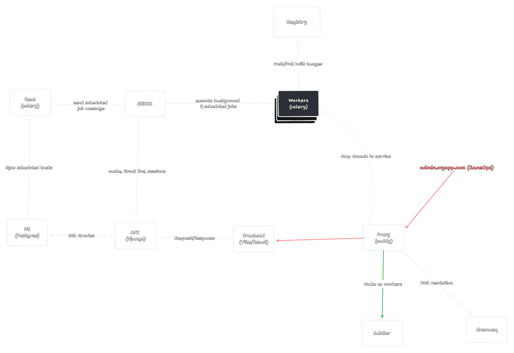
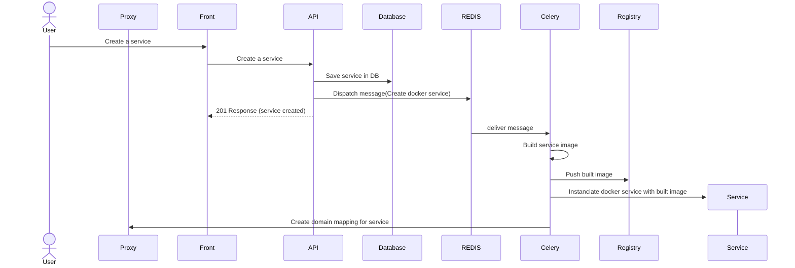

# 🏗️ Architecture of the project

## Overview

ZaneOps is a platform built on Docker and Docker Swarm mode , allowing it to manage and run different applications types across one or multiple servers. 

Docker [Swarm Mode](https://docs.docker.com/engine/swarm/) acts as a manager for Docker containers that are distributed across several host machines. It handles the orchestration, enabling zero-downtime deployment, scaling, and communication of containers between those machines.

Importantly, ZaneOps (API+frontend) is built as a container and deployed like any other service on swarm. This setup is utilized not only for deploying user-specified services but also for orchestrating the deployment of ZaneOps itself.

  <picture>
    <source media="(prefers-color-scheme: dark)" srcset="../images/architecture-dev-dark.png">
    <source media="(prefers-color-scheme: light)" srcset="../images/architecture-dev-light.png">
    
  </picture>

The main components needed to run ZaneOps are : 

1. The **Proxy** which is the entrypoint of the app, its role is to redirect all connections to the appropriate services you defined or to redirect to the ZaneOps dashboard depending on the domain you set for it. it uses a custom [caddy](https://hub.docker.com/_/caddy) docker image built with xcaddy
   1. Caddy exposes an admin API at port `:2019` that we use extensively to programmatically modify the route configuration of the services.
   2. It also handles free SSL for all the domains
2. The **API** which is written in Python with the framework Django and Django Rest Framework for the Rest API part : it handles authentication, authorization and saving objects in the database. It is a build
3. The **Frontend** which is written in React and scaffolded with [Vite](https://vitejs.dev/), it is a pure SPA that talks whith the API to get the data to render.
4. The **database** which is a [postgres](https://hub.docker.com/_/postgres) docker container.
5. a **REDIS** docker image used in tandem with the API for handling caching and session storage for the API and as an event Bus to communicate with celery workers and execute background and scheduled jobs.
   1. All the tasks related to spinning up or down some resources are sent as background jobs
6. Multiple [celery](https://docs.celeryq.dev/en/stable/) **workers** for handling background and scheduled jobs, they receive tasks through the REDIS bus and execute them
   1. Among the tasks handled by celery there are : building services with docker, creating resources for services (volumes, networks) and exposing the service to HTTP by calling the caddy admin API, 
7. A celery **beat** image which in sync with the database schedule jobs and tasks to send to the workers for them to execute, it is like a clocks which execute and read all the scheduled tasks created in the code and queue them in the message bus.
    1. In term of code, the images that celery use is the same as the API, it is on the same project as the API, but executed on another process.
8. a local [**Registry**](https://registry.hub.docker.com/_/registry) docker image used for storing images and artifacts that we create when building images for the services you create.
9.  a [**sablier**](https://github.com/acouvreur/sablier) docker image, sablier is a tool that allow to start containers on demand and shut them down automatically when there's no activity, it is compatible with Docker, Docker Swarm Mode and Kubernetes. 
       1.  We use this preview deployments so that they don't take too much resources, they will be woken up when you hit the endpoint of the preview deployment
       2.  We also use this specifically for services that you wish to run in _"serverless"_ mode, it means images services that can sleep when there is no activity
10. a local DNS server used only on DEV, so that generated urls for the services work, these URLs are generated at `*.zaneops.local`, on production this isn't used as you would tipycally use a real DNS server for mapping urls to IPs. It uses a docker container with the [dnsmasq](https://hub.docker.com/r/andyshinn/dnsmasq) image.

## Schema of a request going to create a service

> TODO

## How is this setup in production ?

ZaneOps is installed via a cli written in Go using [charmcli](https://github.com/charmbracelet) for a beautiful user experience. The cli is used to install the zaneops dashboard and will ask you initial informations for the project like your default user and domain to host the dashboard, once its installed no need to touch the cli to start using it.

The cli will also be used for different tasks such as :
- Resetting the admin's password (in case you forget it)
- Updating zaneops
- Shutting down ZaneOps and uninstalling ZaneOps
- Shutting down the parts of zane-ops that take up too much space in case of an emergency where a service hogs up all of the resources, as well as shutting down some services manually.
- and more...

## Multi-node setup

> TODO/LATER

## How are we different than Coolify ?

We don't know 🤷‍♂️ ! We haven't taken a really good look at [coolify](https://coolify.io/), we inspired ourselves from them but are going our own direction.