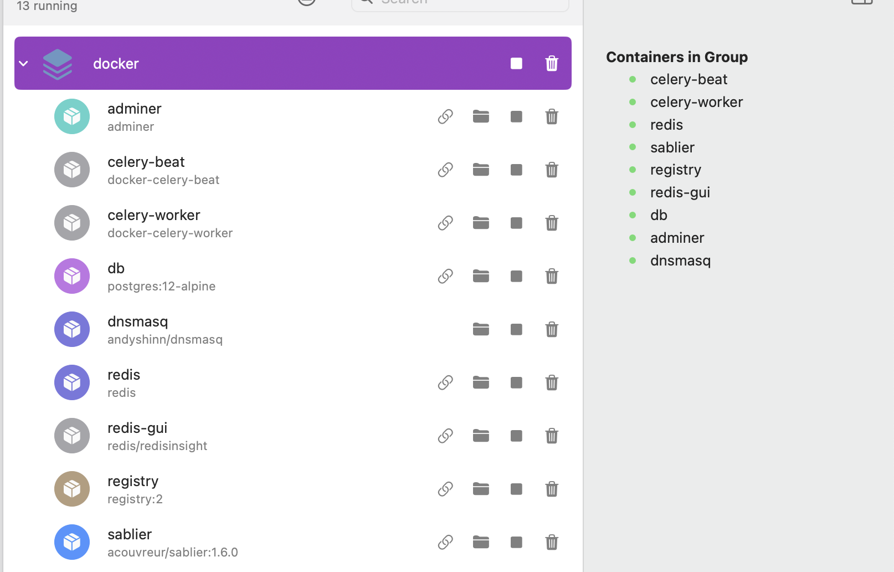

## Projects setup and Architecture

## Requirements

- [Node](https://nodejs.org/en) >= v20.11.1
- [pnpm](https://pnpm.io/installation) >= v8.7.1
- [docker](https://docs.docker.com/engine/install/)
- [docker-compose](https://docs.docker.com/compose/install/)
- [python](https://www.python.org/downloads/) >= v3.11.7
- [biome extension installed in VSCode](https://biomejs.dev/reference/vscode/)

## 🚀 How to work on the project ?

1. First you have to clone the repository

    ```shell
    git clone https://github.com/zane-ops/zane-ops.git
    ``` 

2. **Then run the setup script** :

   ```shell
   make setup
   ```

   If you receive this error message :

    ```
    Error response from daemon: This node is already part of a swarm. Use "docker swarm leave" to leave this swarm and join another one.
    ```
   You can safely ignore it, it means that you have already initialized docker swarm.

3. **Start the project**

   Start the DEV server for docker and the frontend :
    ```shell
    make dev
    # or
    pnpm run  --filter='!backend' --recursive --parallel dev
    ```

   You need to wait for the text `Server launched at http://app.zaneops.local` then, Start the DEV server for the API :
    ```shell
    make dev-api
    # or
	pnpm run  --filter='backend' --recursive dev
    ```

4. **Run DB migrations :**

    ```shell
    make migrate
    ```

5. **Setting up the local domain for development :**
   This step is for allowing you to access the app and generated domains locally
   (for example when you create an app in the GUI), the generated domains will be
   available at `<service-name-project-name>.zaneops.local`.

    1. On Linux, you add localhost to the nameservers in `/etc/resolv.conf` :

       ```shell
       echo "nameserver 127.0.0.1" >> /etc/resolv.conf
       ```

    2. On a Mac, list all your network services :

        ```shell
        sudo networksetup -listallnetworkservices
        ```

    3. You will probably see `Wi-Fi` appear in the list of services,
       if you are connected to it, you can add `127.0.0.1` the list of dns servers :

       ```shell
       # list all the dns servers
       sudo networksetup -getdnsservers Wi-Fi
       # Now add localhost as one dns server
       sudo networksetup -setdnsservers Wi-Fi 127.0.0.1  1.1.1.1 8.8.8.8 8.8.4.4 # the last 3 servers are cloudflare and google dns servers
       ```

    4. Now you should try to run this command to see if the local DNS server is correctly setup :

       ```shell
       nslookup zaneops.local localhost
       ```
       You should get an output like this :

       ```
       Server:     localhost
       Address:    ::1#53
       
       Name:	zaneops.local
       Address: 127.0.0.1
       ```

       If you get an error like this, please ensure that your server is up, (with `make dev`) :
       ```
       ;; connection timed out; no servers could be reached
       ```
       If you still have issues, you can open an issue in the repository, we will have a look at it.

6. **Open the source code and start rocking ! 😎**

   The app should be available at http://app.zaneops.local.

## 🛠️ Debugging

You may end up having issues where the project is not working, the app is not reachable on the browser, or the API seems
to be down, this section is to help debugging this case, if the app is working fine on your end, you don't need to read
this section.

1. make sure you ran `make dev` and it didn't exit unexpectedly
2. make sure that all the containers are up, you can check it in your docker tool of choice, orbstack or docker desktop
   
3. make sure that the API is launched, and that no error is in thrown in the terminal where `make dev` is running
4. make sure to run `nslookup` as stated in the previous section detailling how to setup the local domain
5. make sure to setup the project and install the packages with `make setup`
6. If the app is still unresponsive, run `make reset-db` However, it's crucial to note that this action will completely
   erase all data in the database and reset the project to its initial state.

## 🧐 Project structure

A quick look at the top-level files and directories you will see in this project.

```
  .
  ├── .github/
  │    └── workflows
  │        ├── pytests.yaml
  │        └── check-format.yaml
  ├── backend/
  │   └── zane_api
  ├── frontend/
  │   └── src/
  ├── docker/
  │   ├── proxy
  │   │   └── Dockerfile
  │   ├── docker-stack.yaml
  │   └── docker-compose.yaml
  ├── openapi/
  │   └── schema.yaml
  └── cli
```

1. **`.github/`**: this folder contains the GitHub Actions workflow configuration for Continuous Integration/Continuous
   Deployment.

    1. **`check-format.yaml`** : this workflow is used to check that the frontend files are properly formatted with
       biome.

    2. **`pytests.yaml`** : this workflow is used to test the api of the project.

2. **`backend/`**: A standard Django App, the code source of the API is in the `backend/zane_api/` folder.

3. **`frontend/`**: this folder contains the frontend made with vite and react, you can find the source files of the
   frontend in `frontend/src/`.

4. **`cli/`**: this folder contains the source for the CLI to setup the project, it is written in Go

5. **`docker`**: this folder contains the docker specific files for working with the project locally :
    1. **`docker-compose.yaml`**: this file contains the docker-compose configuration for the services used in
       development : REDIS, postgres, celery, sablier and our local docker registry
    2. **`docker-stack.yaml`**: this file contains the specification for services in developpement
       that needs work within docker swarm : notably, caddy zane-proxy that exposes the services we deploy to HTTP

    3. **`proxy/`** : Folder for cady proxy, it contains a `Dockerfile` to build zane-proxy.

6. **`openapi/schema.yaml`**: this file contains the openapi schema generated from the backend API.
